In most CUDA projects, the advice is usually to transfer all inputs, outputs, and temporary scratch space to the device. Working completely inside VRAM is *fast*, and avoids both the complexity and the throughput hit that comes with over-PCIe transfers being scattered throughout your hot path.

All of this is correct, and I adhere to this myself as much as possible. Sometimes, though, you simply just can't do this, and recently I was left with no choice and had to start migrating stuff back to host memory.

# Pinned memory and when to ~use~ resort to it

## Do less, more times

Let's start with what is *not* a good reason to leave everything in pinned memory. In many processing scenarios, you can get away with slicing or tiling your data in some way:

- Process in sections of rows or columns
- Process in tiles

If your processing is element-wise, then you can effectively cut the data using any method and then treat each sub-unit as its own problem. Invoke the kernel(s) per sub-unit, and hide the latency of the H2D/D2H transfers by having a separate stream(s). This is all standard CUDA at this point.

```mermaid
gantt
    title Tilewise CUDA Processing
    dateFormat x
    tickInterval 1millisecond
    axisFormat %L
    section Tile 1
        H2D                :active, h2d_1, 0, 5
        Processing kernel  :crit, k_1, 5, 15
        D2H                :active, d2h_1, 15, 20
    section Tile 2
        H2D                :active, h2d_2, 10, 15
        Processing kernel  :crit, k_2, 15, 25
        D2H                :active, d2h_2, 25, 30
```



## Until the smallest unit is simply too big

However, when data dependencies across your array/image are non-trivial, then you're out of luck here. Maybe your input element index is just completely unknown until runtime, so for all intents and purposes it's a random lookup. You now have no way to know which row/column/tile to copy up for that particular kernel invocation. So you must have the entire thing available in global memory, query-able at all positions.

But what if your data is huge? 1000 x 1000 images is probably not a big deal, but maybe you're doing precise processing using double precision on 10000x10000 images? Then suddenly this is 800MB of VRAM. 20000x20000 becomes 3.2GB. That's just 1 array. What if you have 10 of these?

My point is that it's not a completely remote possibility if you work on data of this size, especially if the VRAM also needs to be shared with other processes.

# Random but uncommon lookups

In my case, my estimates for my arrays came out to be around 40GB in total. Not viable to hold all of them in VRAM. Okay, so then the first thing I thought was to transfer the data for each step to the GPU, only at that step, and then transfer it back down when finished. Remember, the whole point was that I was memory constrained, so I couldn't have everything on the GPU at the same time.

But this turned out to be pretty bad in my case. Each step took a very short time to compute, and only operated on a few pixels at each step. These pixels were randomly distributed (so I couldn't carve out a tile reliably) but they were also few and far between (so the total time for computation was small). I spent more time copying the array up and down than the kernel.

*Duh, you should be doing more computations (more kernels) before copying it back down.* Again, remember that I was __memory constrained__. I __could not__ do this because the next step would need a different set of arrays, so I would need to clear the first set out from VRAM in order to operate on the next step. It looked something like this:

1. Uses arrays A and B. H2D A and B, invoke `step1_kernel`, D2H B because next step still uses A.
2. Uses arrays A and C. H2D C, invoke `step2_kernel`, D2H A and C.
3. Uses arrays B and D. H2D B and D, invoke `step3_kernel`, D2H B and D.
4. ...

# Mapped pinned memory to the rescue

It turns out that kernels can now (and have been able to for quite some time) *execute directly on pinned host memory pointers*. This comes with the caveat that the pinned host memory is [*mapped*](https://docs.nvidia.com/cuda/cuda-programming-guide/02-basics/understanding-memory.html#mapped-memory), but from my testing on several machines with different (albeit fairly new) CUDA versions, the typical `cudaHostAlloc` and `cudaMallocHost` calls will *automatically* do this. In fact, I could not even turn it off when I tried to.

How this works is the kernel will pull memory from the host over PCIe as and when it is required. If a thread reads a particular address, then the kernel will transfer that memory up to the GPU (with some standard cache-line shenanigans, different from the GPU's global memory read transaction sizes, but that's not the main point here).

This is **great** for my use-case, since I don't touch the majority of my array. I only want it to read/write the few indices that actually get processed by the kernel. These are scattered around the image, so there's no reasonable clean way for me to do this myself unless I invoke another kernel or some host-side function to `cudaMemcpy` only those addresses up. Unnecessary, and in my opinion, very messy.

Instead, I just write the kernel as per normal, wrap the pinned host pointer in a `cudaHostGetDevicePointer()` and let the hardware do its thing. It turned out to be surprisingly effective in my case.

# The kernels really *just work*

There's absolutely nothing different in the way you have to write the kernel (aside from doing weird things like trying to atomically modify a mapped pinned host memory pointer, but why would you even do that).

In fact, most of my kernels were written for device memory at the beginning; when I did my testing, I used small image dimensions so everything fit in VRAM. It was only later, after I realised I didn't have enough VRAM, that I moved the allocations to mapped pinned host memory, and simply wrapped the host pointers:


```cpp
// Original
mykernel<<<grid, blk>>>(d_a, d_b, d_c);

// After
mykernel<<<grid, blk>>>(d_a, d_b, cudaHostGetDevicePointer(h_c));
```

That's the beauty of this, in my opinion. The kernels work seamlessly. I can mix-and-match device and host mapped memory without having to worry about it (other than performance).

All in all, another thing to add to the CUDA toolbox.
